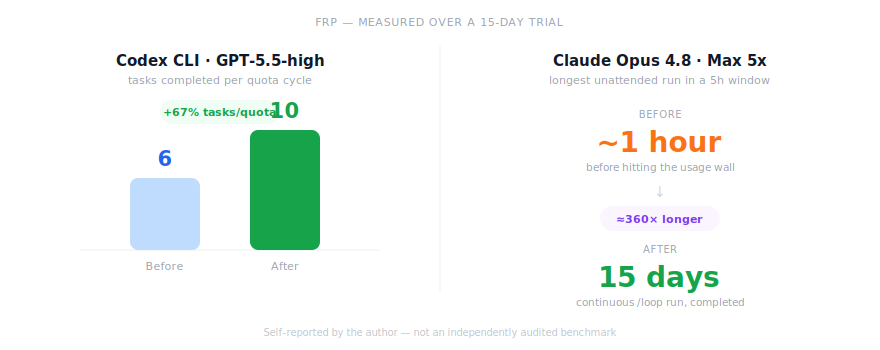

# Function Registry Protocol (FRP)

**AI 코딩 에이전트가 이미 있는 함수를 다시 만드는 걸 막아주는, 그냥 갖다 쓰면 되는 규칙집입니다.**

**Languages:** [English](README.md) · [中文](README.zh-CN.md) · [日本語](README.ja.md) · **한국어** · [Deutsch](README.de.md)

---

## 문제 상황

AI 코딩 에이전트에는 항상 두 가지 비용이 숨어 있습니다.

1. **세션이 시작될 때마다 코드베이스를 처음부터 다시 학습합니다** — grep을 돌리고, 파일을 읽고, 머릿속 모델을 백지에서 재구성하는 과정인데, 이 비용은 저장소 크기에 비례해서 커집니다.
2. **재사용보다 새로 만드는 걸 선호합니다** — 언어 모델 입장에서는 기존 함수가 이미 그 일을 하고 있다는 걸 증명하는 것보다, 그 순간에는 새 함수를 하나 쓰는 게 "더 저렴"하기 때문입니다.

이 두 비용이 수백 번의 세션에 걸쳐 쌓이면, 같은 기능이 다섯 가지 방식으로 각각 구현되고, 어느 게 정본인지 아무도 확신하지 못하고, 그중 어느 것도 지울 용기를 내지 못하는 상황이 벌어집니다. 이건 가정이 아니라 — 가드레일 없이 오래 운영된 AI 보조 코드베이스라면 결국 수렴하게 되는 결과입니다.

**FRP는 "코드베이스를 탐색하라"를 "찾아보라"로 바꾸고, "제발 재사용해줘"를 강제되는 프로토콜로 바꿉니다.**

## 동작 방식

`CLAUDE.md`, `AGENTS.md`, 혹은 사용 중인 툴이 읽는 파일 형식으로 단 하나의 파일을 프로젝트 루트에 넣기만 하면 됩니다. 이 파일은 에이전트에게 이렇게 지시합니다. **함수를 작성하기 전에 항상 레지스트리(`FUNCTIONS.md`)를 먼저 확인할 것. 찾았다면 → 재사용할 것. 거의 비슷한 게 있다면 → 확장할 것. 진짜로 없다면 → 새로 만들고 등록할 것.** 모든 작업은 이 레지스트리를 코드와 동기화한 상태로 마무리됩니다.

이 프로토콜은 세 계층으로 동작하며, 각 계층은 그 정보에 대해 가장 정직할 수 있는 주체가 소유합니다.

| 계층 | 내용 | 소유자 | 이유 |
|---|---|---|---|
| **Fact(사실)** | 함수 이름 / 시그니처 / 경로 / 호출 지점 수 | 스캔 스크립트(에이전트가 직접 작성) | 기계적인 사실은 스크립트에 맡겨야 합니다 — 기억의 오차도, 복사 실수도 없습니다 |
| **Semantic(의미)** | L1~L4 등급 / 한 줄 설명 | 에이전트가 점진적으로 | 판단이 필요한 부분은 스크립트화할 수 없습니다. 손댄 행만 주석을 채우기 때문에 작업당 비용은 그대로 작게 유지됩니다 |
| **Enforcement(강제)** | 레지스트리와 코드의 일치 여부 | pre-commit 훅 | "환경이 안 된다고 한다"는 "프롬프트가 안 된다고 한다"보다 훨씬 신뢰할 수 있습니다 |

그리고 처음부터 거대한 툴링을 요구하는 대신, 프로젝트와 함께 성장합니다.

| Stage | 함수 개수 | 메커니즘 |
|---|---|---|
| 1 | 30개 미만 | 수동으로 관리하는 파일 하나, 툴링 없음 |
| 2 | 30~200개 | 에이전트가 스스로 스캔 스크립트를 작성 — fact 컬럼은 자동화되고, semantic 컬럼은 계속 필요할 때만 채워짐 |
| 3 | 200개 초과 | 레지스트리를 모듈별로 샤딩 — 루트 파일은 인덱스가 되고, pre-commit 훅이 드리프트를 원천적으로 막음 |

함수 등급은 **의존성 방향**에 따라 부여되며, 중요도와는 무관합니다 — 그리고 import는 오직 아래쪽으로만 흐를 수 있기 때문에(L4→L3→L2→L1), 역방향 import는 중복 함수와 마찬가지로 프로토콜 위반입니다.

- **L1 — 순수 유틸리티.** 비즈니스 개념도 없고, 내부 import도 없음.
- **L2 — 공유 컴포넌트.** 두 개 이상의 기능에서 사용되거나, 명백히 사용 가능함.
- **L3 — 비즈니스 로직.** 도메인 개념(user, order, invoice 등)을 담고 있으며, 단일 책임을 가짐.
- **L4 — 진입점.** 라우트, CLI 커맨드, 오케스트레이션.

## 호환 대상

FRP는 그냥 마크다운이기 때문에, 규칙 파일을 읽을 수 있는 어떤 툴에서도 동작합니다. 이 저장소는 주요 툴들이 기대하는 경로에 맞춰 동일한 프로토콜을 미리 포맷해서 제공합니다.

| 툴 | 이 저장소의 파일 | 지원 |
|---|---|---|
| **Claude Code** | [`CLAUDE.md`](CLAUDE.md) | 네이티브 |
| **Codex CLI** | [`AGENTS.md`](AGENTS.md) | 네이티브 |
| **Cursor** | [`.cursor/rules/frp.mdc`](.cursor/rules/frp.mdc) | 네이티브 (현재의 `.mdc` 포맷 — 레거시 `.cursorrules` 파일은 더 이상 사용되지 않으며 Agent 모드에서 조용히 무시됩니다) |
| **Windsurf** | [`.windsurfrules`](.windsurfrules) | 네이티브 |
| **Cline / Roo Code** | [`.clinerules/frp.md`](.clinerules/frp.md) | 네이티브 |
| **GitHub Copilot** | [`.github/copilot-instructions.md`](.github/copilot-instructions.md) | 네이티브 |
| **Gemini CLI / Gemini Code Assist** | [`GEMINI.md`](GEMINI.md) | 네이티브 |
| Amp, Devin, Zed, Jules, VS Code, JetBrains Junie, Warp, Factory | [`AGENTS.md`](AGENTS.md) | 위 도구들이 모두 네이티브로 읽는 공개 [AGENTS.md](https://agents.md) 표준을 통해 지원 |

여덟 개 파일 모두 제목 줄만 다르고 나머지는 완전히 동일합니다 — 사용 중인 툴에 맞는 파일 하나만 복사해도 되고, 그냥 전부 복사해두고 더 이상 신경 쓰지 않아도 됩니다.

## 실제로 뭔가 달라지나요? 직접 측정해봤습니다

15일 동안 실제 작업에 FRP를 적용해봤습니다 — 장시간 무인으로 돌아가는 `/loop` 방식의 작업 큐였고, Max 5x 시트에서 Extended Thinking과 서브에이전트를 켠 Claude Opus 4.8, 그리고 별도로 Plus 시트에서 GPT-5.5-high로 돌린 Codex CLI 트랙을 함께 사용했습니다. 아래에서 "Task(작업)"란 개발 프레임워크의 작업 그래프에서 노드 하나를 의미하며, 매번 비교 가능한 동일한 단위의 작업입니다.

  

| 구성 | FRP 적용 전 | FRP 적용 후 |
|---|---|---|
| Codex CLI (GPT-5.5-high, Plus 시트) — 할당량이 끊기기 전까지 완료한 작업 수 | 6개 작업에서 하드캡 | **10개 작업** |
| Claude Opus 4.8 (Max 5x, Extended Thinking, 서브에이전트) — 5시간 윈도우 내 최장 무인 실행 시간 | **약 1시간** 만에, 때로는 그보다도 빨리 무너져 노이즈로 전환됨 | **15일** 연속으로 돌아가는 `/loop` 작업을 완주 |

*이 수치는 저자가 개인적으로 사용하면서 직접 로그로 남긴 것이며, 독립적으로 감사받은 벤치마크가 아닙니다 — 그래도 공유하는 이유는 "토큰을 더 적게 쓴다"는 주장을 그냥 믿음으로 받아들이게 하고 싶지 않아서입니다.*

**왜 이게 성립하는가**: 장시간 작업에서 에이전트의 토큰 예산 대부분은 코드를 작성하는 데 쓰이는 게 아니라, 이미 존재하는 코드를 *다시 발견*하는 데 쓰입니다. FRP는 이 발견 과정을 이미 컨텍스트에 들어 있는 파일에 대한 조회로 대체하기 때문에, 모든 작업이 더 저렴하게 시작하고, 더 천천히 저하되며, 컨텍스트나 할당량의 벽에 부딫히기 전까지 더 오래 살아남습니다.

## 예시로 살펴보기

`src/lib`에 약 85개의 export된 함수가 있는 중간 규모 백엔드가 있다고 해봅시다. FRP 없이는, 3주에 걸쳐 서로 다른 세 개의 작업이 각각 "주문의 할인된 배송비를 계산"하는 기능을 필요로 하게 되고, 각각은 서로에 대한 기억이 전혀 없는 별개의 세션에서 처리됩니다. 결과는 `calcShipping`, `getShippingCost`, `computeShippingTotal`이 전부 존재하고, 각각 반올림 방식이 미묘하게 다르며, 다음에 올라오는 버그 리포트는 "체크아웃이 실제로 호출하는 게 어느 함수냐"가 됩니다.

FRP를 쓰면 이렇게 됩니다.

- **작업 1**은 `computeShippingCost`(L3)를 만들어 `FUNCTIONS.md`에 등록하고 끝납니다.
- **작업 2**는 같은 기능에 프로모 코드 할인을 추가로 필요로 합니다. 에이전트가 먼저 레지스트리를 검색해서 **HIT**을 받고, 80%가 일치한다는 걸 확인한 뒤, 형제 함수를 새로 쓰는 대신 `promoCode?` 파라미터를 추가해서 **EXTEND**합니다.
- **작업 3**은 3주 후 완전히 새로운 세션에서 시작되지만, 뭔가를 작성하기 전에 "shipping"으로 먼저 검색해서 같은 함수를 찾아내고 그대로 재사용합니다.

함수는 하나, 진실의 소스도 하나, "어느 게 정본이냐"를 디버깅하는 세션은 0번 — 그리고 레지스트리 트레이스(`REGISTRY: HIT computeShippingCost (L3) …`)가 남아 있기 때문에, diff를 다시 읽지 않고도 각 작업에서 에이전트가 정확히 어떤 판단을 내렸는지 검토할 수 있습니다.

## 빠르게 시작하기

1. [`CLAUDE.md`](CLAUDE.md)(또는 위 표에서 사용 중인 툴에 맞는 파일)를 프로젝트 루트에 복사합니다.
2. 평소처럼 아무 작업이나 시작합니다. 프로토콜이 자동으로 작동합니다. `FUNCTIONS.md`가 아직 없다면 → 먼저 하나를 부트스트랩하고, 이미 있다면 → 새 함수를 작성하기 전에 항상 먼저 확인합니다.
3. 오래된 코드베이스에 있는 기존 함수들은 **미리 전부** 주석 처리되지 않습니다 — 그렇게 하면 막대한 일회성 토큰 비용이 발생합니다. semantic 컬럼은 해당 함수를 다루는 작업이 생길 때 그 한 행만 채워지기 전까지 빈칸으로 남습니다. 레지스트리는 콜드 스타트 비용을 거의 0에 가깝게 유지하면서 점진적으로 제 몫을 합니다.

## 숫자들이 왜 이렇게 정해졌는가

- **함수 ≤ 50줄 / 파일 ≤ 300줄 / 중첩 ≤ 3단계**: 모델은 "깔끔하게 유지해"같은 형용사보다 확실한 숫자를 훨씬 더 잘 지킵니다.
- **폴더 깊이 ≤ 4**: 트리가 깊어질수록 파일을 찾는 데 왕복이 더 많이 필요해집니다 — 구분은 중첩이 아니라 네이밍과 책임에서 나와야 합니다.
- **Rule of Three**: 잘못된 추상화는 중복보다 비용이 더 큽니다. 두 번째 등장은 허용하되, 세 번째 등장에서만 추출을 강제합니다 — 이게 조급한 추상화를 시작 단계에서 막아줍니다.
- **설명은 12단어 이하, 테이블 정렬 패딩 없음, 파일 전체 재작성 없음**: 레지스트리 자체가 매 세션마다 지불하는 고정비이기 때문에, 그 안의 모든 바이트가 존재 가치를 증명해야 합니다.
- **필수 `REGISTRY:` 트레이스 라인**: 십여 개 토큰이 드는 대신 두 가지를 얻습니다 — 소리 내어 말해야 하는 단계는 실제로 지켜질 가능성이 더 높다는 점, 그리고 모델이 이 단계를 건너뛰었는지 한눈에 감사할 수 있다는 점입니다.

## 대략적인 토큰 계산

작업당 고정비는 대략 프로토콜 본문(~1천 토큰) + 관련 레지스트리 샤드(수백 토큰) + 증분 주석(1~2백 토큰) — 합쳐서 대략 ~1.5천 토큰 정도입니다. 이걸 중간 규모 코드베이스를 맹목적으로 탐색하는 비용과 비교해보면, 그건 보통 수만 토큰 단위로 치솟고, 여기에 이미 존재하던 함수를 다시 생성하는 데 드는 토큰까지 더해집니다. 프로젝트가 클수록, 세션이 많을수록 이 격차는 더 벌어집니다.

## FAQ

**이미 지저분한 기존 코드베이스에도 얹을 수 있나요?** 네. 부트스트랩은 fact 컬럼만 채웁니다. 모든 semantic 컬럼은 빈칸에서 시작해서 필요할 때마다 채워집니다. 초기 테이블을 만드는 비용은 저렴합니다.

**약하거나 저렴한 모델도 실제로 이걸 잘 따를까요?** 이 프로토콜은 판단이 필요한 부분을 결정 트리와 IF/THEN 규칙으로 바꿔주고(등급 판단은 네 개의 yes/no 체크로 끝납니다), 감사 가능성을 위해 `REGISTRY:` 트레이스 라인을 강제하며, 모든 것을 pre-commit 훅으로 뒷받침합니다. 이건 지능 문제를 프로세스 문제로 바꾸는 것이고 — 저렴한 모델은 판단을 내리는 것보다 프로세스를 따르는 데서 훨씬 더 신뢰할 만합니다.

**저렴한 모델이 똑똑한 코드를 쓰게 만들어주나요?** 솔직히 말하면 아닙니다 — 이건 개별 함수 본문의 영리함이 아니라 아키텍처와 재사용률을 개선합니다. 하지만 이건 누적됩니다. 재사용될 때마다 약한 모델이 처음부터 작성해야 할 함수가 하나 줄어드는 것이고, 그만큼 품질은 이미 검증된 컴포넌트로 이루어진 라이브러리에 쌓여갑니다. 모델의 역할은 "작성자"에서 "조립자"로 조용히 옮겨가는데, 이건 저렴한 모델이 정확히 신뢰할 수 있는 역할입니다.

**여러 사람이나 여러 세션이 동시에 작업하면 어떻게 되나요?** 레지스트리는 git에 저장되기 때문에 충돌은 일반적인 머지로 해결됩니다. Stage 2부터는 스캔 스크립트를 다시 돌리면 fact 컬럼은 처음부터 다시 만들어지는 반면, 계약상 손으로 작성한 semantic 컬럼은 반드시 *보존*되어야 합니다.

**레지스트리 자체가 죽은 항목 더미로 변하지 않을까요?** 아닙니다 — `refs` 컬럼이 고아 항목을 눈에 보이게 만듭니다. 참조가 0이면 → `[DEPRECATED]`로 표시되고 → 그 모듈을 다음에 누군가 다루게 될 때 (함수와 행이 함께) 삭제됩니다. 항목은 들어올 때와 같은 방식으로 나갑니다.

## 조정 가능한 값들

Stage 임계값(30 / 200), 줄 수 제한(50 / 300), 폴더 깊이(4), 설명 길이(12단어)는 모두 그냥 숫자일 뿐입니다 — 팀의 취향에 맞게 바꾸세요. 바꾼다면 프로토콜 파일 §10의 셀프체크 목록도 함께 업데이트해서, 규칙과 체크가 서로 어긋나지 않게 해주세요.

---

실질적인 내용은 두 파일로 나뉩니다. 프로토콜 본문(프로젝트에 복사해서 쓰는 파일)과 이 README(사람을 위한 설명)입니다. 스캔 스크립트는 일부러 포함하지 않았습니다 — Stage 2에 도달하면 §7에 고정된 계약에 따라 에이전트가 여러분의 스택에 맞춰 직접 작성합니다. 이렇게 해야 프로토콜이 특정 스택에 종속되지 않고, 툴링 자체도 함께 진화하는 대상이 됩니다.
